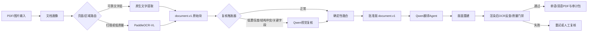

# PaddleOCR-VL + Qwen3.8-Flash Hybrid Document Intelligence Implementation Plan

> **For agentic workers:** REQUIRED SUB-SKILL: Use superpowers:subagent-driven-development (recommended) or superpowers:executing-plans to implement this plan task-by-task. Steps use checkbox (`- [ ]`) syntax for tracking.

**Goal:** 在保留现有 PDF 翻译和版面重建能力的前提下，把 PaddleOCR-VL 作为可追溯主 OCR，把 Qwen 作为按需视觉复核、语义纠错和翻译 Agent，并同时支持云端与未来私有云模型。

**Architecture:** 以现有 `document.v1.json` 标准化文档作为唯一中间契约，增加“文档画像 -> OCR 路由 -> 候选结果融合 -> 翻译 -> 渲染 -> 质量门禁”六阶段工作流。Paddle 原始结果不可覆盖；Qwen 只处理低置信度、结构冲突或关键字段区域，并输出候选建议及理由，由确定性策略决定是否采用。

**Tech Stack:** FastAPI、Python、PaddleOCR-VL、OpenAI-compatible Qwen API、现有 RetainPDF/BabelDOC、SQLite（单机阶段）、Typst、pytest/unittest。

---

## 1. 决策摘要

当前系统不需要重写。应保留：

- `/tasks` 上传和结果下载接口；
- `v3` 文本层翻译路径；
- RetainPDF 的 OCR、标准化、翻译和渲染路径；
- OCR Provider 注册机制；
- `document.v1.json` 标准化文档；
- 已有 `TranslationAgentRuntime` 的 LLM 调用封装。

需要重点调整：

1. 把用户手工传入的 `text_based` 二选一路由升级为自动画像和可解释策略；
2. 把 Paddle 与 Qwen 从“两个互相替代的 OCR”改成“主识别 + 按需复核”；
3. 为每个文本块保存来源、坐标、原值、候选值和最终裁决；
4. 将任务状态从进程内字典迁移到 SQLite，避免服务重启丢任务；
5. 分离 API、OCR、Agent、翻译和渲染 worker，避免一次任务拖垮整个服务；
6. 加入关键字段不可静默改写和渲染后反查质量门禁。

## 2. 当前代码依据

| 事实 | 状态 | 代码证据 |
|---|---|---|
| 当前路由由调用者传入 `text_based`，整本只选一个引擎 | verified-static | `classify.py:25-35`, `orchestrate.py:213-221` |
| API 已接受 OCR provider、模型和翻译模型配置 | verified-static | `app.py:229-250`, `app.py:280-298` |
| RetainPDF 已把 OCR 与翻译配置放入独立 spec | verified-static | `retain.py:318-390` |
| OCR provider 已有注册表，可扩展本地/远程实现 | verified-static | `pipeline/services/ocr_provider/drivers.py:30-105` |
| OCR 完成后已有标准化文档，再进入翻译和渲染 | verified-static | `pipeline/services/ocr_provider/provider_pipeline.py:367-425` |
| 已有基础 Agent Runtime，但目前只顺序执行 LLMTask | verified-static | `pipeline/services/translation/services/agents/runtime.py:14-92` |
| 任务状态保存在进程内，重启丢失 | verified-static | `store.py:130-139` |
| Paddle AI Studio 鉴权修复已具备回归测试 | verified-executed | `pipeline/services/ocr_provider/paddle_api.py:50-55`, `tests/test_paddle_auth_header.py` |

快照：`main@7a2cdceca86f1f02e390408aa0defaf5addae64c`，工作区当前包含尚未提交的本机兼容性和 Paddle 鉴权修复。本计划不假设这些改动已发布。

## 3. 目标数据流



## 4. 核心契约

每个识别块至少保存：

```python
@dataclass(frozen=True)
class OcrCandidate:
    provider: str
    text: str
    bbox: tuple[float, float, float, float]
    confidence: float | None
    evidence_path: str


@dataclass(frozen=True)
class ResolvedBlock:
    block_id: str
    raw: OcrCandidate
    alternatives: tuple[OcrCandidate, ...]
    selected_text: str
    decision: str
    requires_human_review: bool
```

约束：

- `raw` 永远保留，不允许 Qwen 覆盖；
- 金额、日期、编号、页码、公式属于关键字段；
- Qwen 与 Paddle 在关键字段上不一致时必须进入人工复核；
- 普通正文只有在规则允许且 Qwen 返回结构化证据时才能自动采用；
- 每个最终段落必须能回溯到页码、坐标和 provider。

## 5. 文件结构

新增：

- `pipeline/services/document_intelligence/contracts.py`：候选、裁决和审计数据类型；
- `pipeline/services/document_intelligence/profile.py`：页面文字层和图像质量画像；
- `pipeline/services/document_intelligence/routing.py`：页面/区域 OCR 路由；
- `pipeline/services/document_intelligence/qwen_review.py`：Qwen 视觉复核适配器；
- `pipeline/services/document_intelligence/fusion.py`：确定性融合和关键字段门禁；
- `pipeline/services/document_intelligence/workflow.py`：六阶段编排；
- `pipeline/services/document_intelligence/audit.py`：审计 JSONL 输出；
- `task_repository.py`：SQLite 任务持久化；
- `tests/test_document_profile.py`；
- `tests/test_ocr_routing.py`；
- `tests/test_ocr_fusion.py`；
- `tests/test_qwen_review_contract.py`；
- `tests/test_task_repository.py`；
- `tests/fixtures/hybrid_documents/`：脱敏验收样本。

修改：

- `app.py`：增加 processing profile，保留 `text_based` 向后兼容；
- `classify.py`：从整本布尔值升级为页面路由计划；
- `orchestrate.py`：调用新工作流并上报细阶段；
- `retain.py`：传递复核策略和本地/云端模型网关配置；
- `store.py`：改为 TaskRepository 门面；
- `pipeline/services/ocr_provider/provider_pipeline.py`：在标准化后插入复核和融合；
- `pipeline/services/translation/services/agents/runtime.py`：支持有依赖关系的计划和结构化结果校验；
- `.env.example`：增加 provider、阈值和本地网关配置，不加入任何真实凭证。

## 6. 分阶段实施

### Task 1: 固化 OCR 证据与裁决契约

**Files:**
- Create: `pipeline/services/document_intelligence/contracts.py`
- Create: `tests/test_ocr_fusion.py`

- [ ] **Step 1: 写失败测试，证明原始 OCR 不可被覆盖**

```python
def test_resolved_block_keeps_raw_candidate_when_qwen_differs():
    raw = OcrCandidate("paddle", "合同金额1000元", (0, 0, 10, 10), 0.91, "p1.json")
    review = OcrCandidate("qwen", "合同金额10000元", (0, 0, 10, 10), None, "p1.png")
    result = resolve_block("b1", raw, [review], critical=True)
    assert result.raw.text == "合同金额1000元"
    assert result.selected_text == "合同金额1000元"
    assert result.requires_human_review is True
```

- [ ] **Step 2: 运行红灯测试**

```powershell
python -m pytest tests/test_ocr_fusion.py -q
```

Expected: FAIL，因为 `OcrCandidate` 和 `resolve_block` 尚不存在。

- [ ] **Step 3: 实现最小不可变契约**

实现 `OcrCandidate`、`ResolvedBlock`，所有字段可 JSON 序列化；禁止在对象构造后修改原始候选。

- [ ] **Step 4: 运行测试并提交**

```powershell
python -m pytest tests/test_ocr_fusion.py -q
git add pipeline/services/document_intelligence/contracts.py tests/test_ocr_fusion.py
git commit -m "feat: add traceable OCR resolution contracts"
```

Expected: PASS。

### Task 2: 自动文档画像与兼容路由

**Files:**
- Create: `pipeline/services/document_intelligence/profile.py`
- Create: `pipeline/services/document_intelligence/routing.py`
- Create: `tests/test_document_profile.py`
- Create: `tests/test_ocr_routing.py`
- Modify: `classify.py:25-35`
- Modify: `app.py:229-298`

- [ ] **Step 1: 写画像和路由失败测试**

```python
def test_low_text_coverage_routes_page_to_paddle():
    page = PageProfile(page_index=0, text_chars=3, text_coverage=0.001, image_coverage=0.98)
    assert build_route(page, profile="auto").primary_provider == "paddle"


def test_manual_text_mode_remains_backward_compatible():
    page = PageProfile(page_index=0, text_chars=300, text_coverage=0.2, image_coverage=0.1)
    assert build_route(page, profile="text").primary_provider == "native"
```

- [ ] **Step 2: 实现 `processing_profile`**

允许值：`auto`、`text`、`scan`、`hybrid`。旧参数转换规则：

```python
if processing_profile is None:
    processing_profile = "text" if text_based else "scan"
```

- [ ] **Step 3: 输出可解释路由计划**

```python
@dataclass(frozen=True)
class PageRoute:
    page_index: int
    primary_provider: str
    review_policy: str
    reasons: tuple[str, ...]
```

- [ ] **Step 4: 验证兼容性**

```powershell
python -m pytest tests/test_document_profile.py tests/test_ocr_routing.py -q
```

Expected: 原 `text_based=true/false` 行为不变，`auto` 才启用新画像。

### Task 3: 增加 Qwen 视觉复核适配器

**Files:**
- Create: `pipeline/services/document_intelligence/qwen_review.py`
- Create: `tests/test_qwen_review_contract.py`
- Modify: `pipeline/services/translation/services/agents/runtime.py:32-92`

- [ ] **Step 1: 写结构化输出失败测试**

```python
def test_qwen_review_rejects_unstructured_answer():
    client = FakeVisionClient(response="看起来应该是10000")
    with pytest.raises(ReviewContractError):
        review_crop(client, crop_bytes=b"png", paddle_text="1000")
```

- [ ] **Step 2: 定义稳定协议**

Qwen 必须返回：

```json
{
  "observed_text": "合同金额1000元",
  "agrees_with_primary": true,
  "confidence": 0.93,
  "reason_codes": ["clear_print"],
  "uncertain_spans": []
}
```

- [ ] **Step 3: 抽象模型网关**

```python
class VisionReviewClient(Protocol):
    def review(self, image: bytes, prompt: str) -> VisionReviewResult: ...
```

实现 OpenAI-compatible 适配器；`base_url` 和 `model` 必须来自服务端配置。未来私有云只替换网关地址，不修改工作流。

- [ ] **Step 4: 限定调用范围**

仅触发：低置信度块、乱码、表格结构冲突、跨页断句冲突、关键字段或用户明确要求的全量复核。默认禁止逐页全图发送给 Qwen。

- [ ] **Step 5: 运行测试**

```powershell
python -m pytest tests/test_qwen_review_contract.py -q
```

Expected: 非 JSON、缺字段和越权改写均失败。

### Task 4: 实现 Paddle 主识别 + Qwen 裁决融合

**Files:**
- Create: `pipeline/services/document_intelligence/fusion.py`
- Create: `pipeline/services/document_intelligence/audit.py`
- Modify: `pipeline/services/ocr_provider/provider_pipeline.py:367-425`
- Extend: `tests/test_ocr_fusion.py`

- [ ] **Step 1: 写关键字段冲突测试**

```python
@pytest.mark.parametrize("text", ["1000元", "2026-09-20", "HT-2026-001", "x²+y²"])
def test_critical_field_conflict_never_auto_accepts_qwen(text):
    result = resolve_candidates(primary=text, review=text + "X", critical=True)
    assert result.requires_human_review
    assert result.selected_provider == "paddle"
```

- [ ] **Step 2: 实现确定性裁决表**

| 条件 | 动作 |
|---|---|
| Paddle 高置信度且无结构冲突 | 直接采用 Paddle |
| 两者一致 | 采用 Paddle，记录 Qwen 确认 |
| 普通正文、Paddle 低置信度、Qwen 高置信度 | 可采用 Qwen，保留两份证据 |
| 关键字段不一致 | 保留 Paddle，标记人工复核 |
| 两者均不确定 | 不猜测，标记人工复核 |

- [ ] **Step 3: 输出 `ocr-audit.jsonl`**

每行包含 `job_id/page/block_id/raw/candidates/decision/reason/evidence_paths`，不写入凭证、完整请求头或临时签名 URL。

- [ ] **Step 4: 在标准化后插入融合**

保持 `document.v1.json` 为下游唯一入口；新文件命名为 `document.approved.v1.json`，翻译阶段只读取批准版。

- [ ] **Step 5: 运行单元测试和一页真实请求**

```powershell
python -m pytest tests/test_ocr_fusion.py tests/test_qwen_review_contract.py -q
```

Expected: 冲突不会静默覆盖，审计记录不含密钥。

### Task 5: 将 Qwen 翻译 Agent 接到批准版文档

**Files:**
- Modify: `pipeline/services/translation/services/agents/runtime.py:14-92`
- Modify: `pipeline/services/ocr_provider/provider_pipeline.py:391-430`
- Create: `tests/test_translation_agent_plan.py`

- [ ] **Step 1: 写有依赖任务的失败测试**

```python
def test_translation_waits_for_terminology_and_context_tasks():
    plan = build_translation_plan(document, target_lang="zh")
    assert plan.dependencies["translate:p1:b1"] == (
        "terminology:document",
        "context:p1",
    )
```

- [ ] **Step 2: 将 Agent 任务拆成四类**

`terminology`、`context`、`translate`、`quality_review`。只有 `translate` 可以产生译文；其他任务只产生约束和问题清单。

- [ ] **Step 3: 保留逐块来源映射**

译文记录必须包含 `source_block_id`、`source_text_hash`、`model`、`prompt_version`、`glossary_version`。

- [ ] **Step 4: 验证缓存与重试幂等**

相同 `source_text_hash + target_lang + prompt_version + glossary_version` 必须命中同一个缓存键；失败重试不得生成重复段落。

### Task 6: 任务持久化与进程隔离

**Files:**
- Create: `task_repository.py`
- Create: `tests/test_task_repository.py`
- Modify: `store.py:130-178`
- Modify: `orchestrate.py:198-329`

- [ ] **Step 1: 写重启恢复失败测试**

```python
def test_running_task_is_recovered_as_interrupted(tmp_path):
    repo = SqliteTaskRepository(tmp_path / "tasks.db")
    repo.add(task(status="running"))
    repo = SqliteTaskRepository(tmp_path / "tasks.db")
    assert repo.get("t1")["status"] == "interrupted"
```

- [ ] **Step 2: 建立最小 SQLite 表**

字段：`task_id`、`status`、`stage`、`input_path`、`work_dir`、`request_json`、`result_json`、`error_json`、`created_at`、`updated_at`。敏感凭证只存 credential reference，不存明文。

- [ ] **Step 3: 增加阶段检查点**

检查点：`uploaded`、`profiled`、`ocr_done`、`review_done`、`translation_done`、`render_done`、`qa_done`。重启后从最后一个完整检查点恢复。

- [ ] **Step 4: 分离 worker**

单机第一阶段仍可用进程内队列，但 OCR、LLM 和渲染必须运行在独立子进程并设置内存/超时边界；私有云阶段再替换为 Redis/RabbitMQ，不在第一阶段提前引入。

- [ ] **Step 5: 验证服务重启不丢任务**

```powershell
python -m pytest tests/test_task_repository.py -q
```

Expected: 已完成任务可下载，运行中任务转为可恢复状态。

### Task 7: API、权限和兼容迁移

**Files:**
- Modify: `app.py:229-325`
- Modify: `store.py:178-247`
- Create: `tests/test_task_api_profiles.py`

- [ ] **Step 1: 增加新参数但保留旧调用**

```text
processing_profile=auto|text|scan|hybrid
ocr_review=off|low_confidence|critical_fields|all
quality_gate=standard|strict
```

旧客户端只传 `text_based` 时保持现有结果。

- [ ] **Step 2: 返回可解释状态**

任务公开状态增加：`profile_summary`、`route_summary`、`reviewed_blocks`、`human_review_blocks`、`quality_gate_status`；不得返回 Token、原始请求头或内部 traceback。

- [ ] **Step 3: 服务端权限约束**

客户端不得传任意 `base_url` 到生产环境；只允许选择服务端注册的 `model_profile_id`。未知模型、未配置模型和非白名单地址必须返回 400。

- [ ] **Step 4: API 回归测试**

```powershell
python -m pytest tests/test_task_api_profiles.py -q
```

Expected: 旧参数兼容，新参数可验证，敏感字段不出现在响应。

### Task 8: 渲染后质量门禁和业务验收

**Files:**
- Create: `pipeline/services/document_intelligence/render_qa.py`
- Create: `tests/test_render_quality_gate.py`
- Create: `docs/hybrid-ocr-acceptance.md`

- [ ] **Step 1: 写质量门禁失败测试**

```python
def test_missing_critical_number_fails_quality_gate():
    report = compare_rendered_text(
        approved="合同编号 HT-2026-001",
        rendered="合同编号 HT-2026-01",
    )
    assert report.passed is False
    assert report.reason_codes == ("critical_token_missing",)
```

- [ ] **Step 2: 建立脱敏基准集**

至少 50 份、300 页，覆盖：清晰电子 PDF、低清扫描、多栏、表格、公式、印章、手写批注、旋转/倾斜、跨页段落和中英混排。

- [ ] **Step 3: 固定验收指标**

| 指标 | 首期门槛 |
|---|---:|
| 清晰印刷文本字符错误率 CER | <= 0.5% |
| 扫描文本 CER | <= 2.0% |
| 关键金额/日期/编号静默改写 | 0 |
| 表格结构 TEDS | >= 0.90 |
| 强制术语命中率 | >= 99% |
| 输出 PDF 空白/乱码/严重遮挡 | 0 页 |
| 所有失败任务可定位到阶段和 provider | 100% |

- [ ] **Step 4: 做 A/B 对照**

对同一基准集运行：`Paddle-only`、`Qwen-only`、`Paddle+Qwen-review`。组合方案只有在准确率提升且关键字段零静默错误时才能设为默认。

- [ ] **Step 5: 发布门禁**

先灰度 `processing_profile=hybrid`，保留 `scan` 和 `text` 快速回退。发布包必须包含配置备份、数据库备份、模型 profile 清单和回滚命令。

## 7. 推荐实施顺序与工作量

| 阶段 | 内容 | 单人估算 | 可交付结果 |
|---|---|---:|---|
| P0 | 当前运行稳定化：缓存预热、鉴权、错误信息 | 2-3天 | 可重复启动和测试 |
| P1 | 契约、画像、自动路由 | 4-6天 | `auto/text/scan/hybrid` 可用 |
| P2 | Qwen 复核、融合、审计 | 5-8天 | Paddle+Qwen 组合闭环 |
| P3 | Agent 翻译计划、质量门禁 | 5-8天 | 可追溯翻译与成品验收 |
| P4 | SQLite 持久化、子进程隔离、恢复 | 4-7天 | 服务重启不丢任务 |
| P5 | 300页基准、灰度和回滚 | 4-6天 | 可做生产决策的证据包 |

合计约 24-38 个开发日；可先完成 P0-P2，形成 11-17 天的可用组合版本。估算不包含 UI 大改、企业级账号权限和私有云硬件部署。

## 8. 本地与私有云部署边界

- OCR 层固定依赖 `OcrProvider` 接口，不依赖百度云地址；云端 Paddle 和本地 PaddleX 是两个适配器。
- Qwen 层固定依赖 OpenAI-compatible `ModelGateway`；当前云端模型和未来公司私有云使用不同 profile。
- 模型名称、地址、证书和密钥只存在服务端配置中心；任务表保存 profile ID。
- 禁止把当前云端 Token Plan 当作未来私有云部署证明；部署前必须确认模型权重、授权、推理框架和硬件基线。

## 9. 风险与红线

1. 不允许 Qwen 静默覆盖 Paddle 原始 OCR。
2. 不允许金额、日期、编号、公式在模型冲突时自动采用生成结果。
3. 不允许在任务数据库、日志、审计 JSON 或前端响应中保存明文密钥。
4. 不允许只凭一页冒烟样本宣称 OCR 或翻译质量达标。
5. 不允许自动模式取消 `text/scan` 人工强制路由和回滚能力。
6. 不允许将任务状态继续仅保存在进程内后进入生产。
7. 不允许每次服务启动重复下载数百 MB 模型资产；需校验缓存元数据和离线资产包。

## 10. 完成定义

- 原有文本型 PDF 和扫描型 PDF 接口回归通过；
- Paddle 原始块、Qwen 候选、最终裁决均可追溯；
- 关键字段冲突能够阻止自动交付；
- 服务重启后任务和结果仍可查询；
- 300 页基准集达到既定门槛；
- 云端/本地 Paddle 与云端/私有 Qwen 可通过 profile 切换；
- 操作手册包含启动、停机、备份、恢复、密钥轮换和回滚步骤。

## 11. Agent Handoff

```yaml
query_routes:
  api: [app.py, store.py]
  routing: [classify.py, orchestrate.py]
  ocr-provider: [retain.py, pipeline/services/ocr_provider]
  normalized-document: [pipeline/services/document_schema]
  translation-agent: [pipeline/services/translation/services/agents]
  rendering: [pipeline/services/rendering]
  operations: [config.py, .env.example, Dockerfile, docker-compose.yml]
redlines:
  - never overwrite raw OCR evidence
  - never expose credentials in task state or logs
  - never auto-resolve critical-field disagreement
answer_contract:
  - conclusion
  - affected stage and provider
  - source block and evidence locator
  - user-visible impact
  - confidence and unresolved conflicts
coverage:
  included_modules: 8
  excluded_modules: 0
  evidence_records: 7
```

